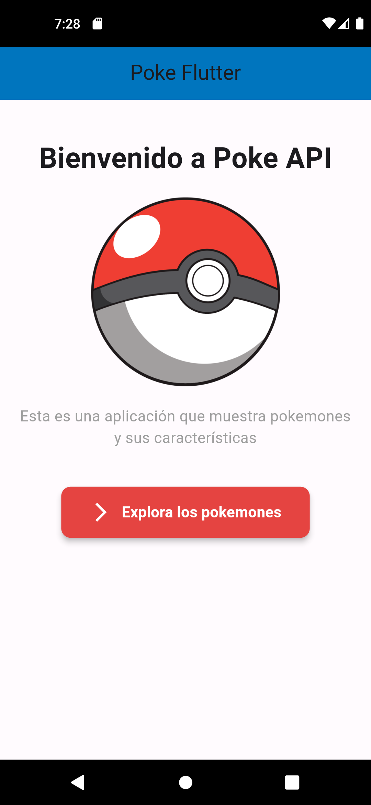
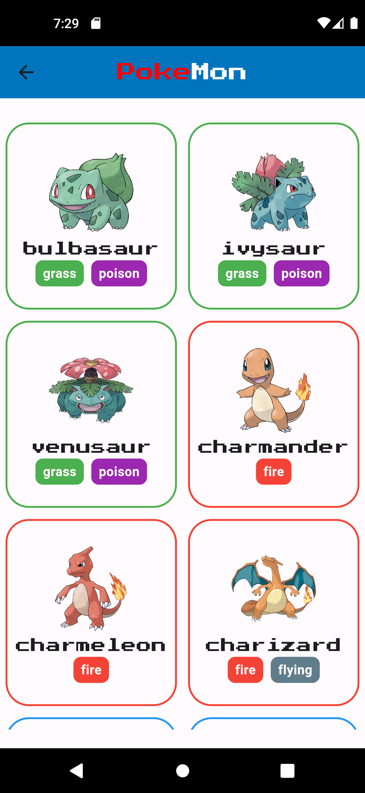

# ポケフラッター

[English](./README.md) | [Español](./README.es.md) | [Français](./README.fr.md) | [日本語](./README.jp.md)

## 説明

ポケフラッターは、Flutterで開発されたモバイルアプリで、ポケモンに関する情報を提供します。このアプリケーションは、[PokéAPI](https://pokeapi.co/)を使用して異なるポケモンに関する詳細なデータを取得し、ユーザーがお気に入りのキャラクターについて詳しく探索し学ぶことを可能にします。

## 主な特徴

- **ポケモンリスト**: 画像と基本データを備えたポケモンの完全なリストを表示します。

### 進行中 

- ~**ポケモン検索**: ユーザーが任意のポケモンに関する詳細な情報を検索できるようにします。~
  
- ~**詳細情報**: 各ポケモンの統計、能力などの詳細情報を提供します。~

## インストール要件

- Flutter SDK: Flutter SDKがインストールされていることを確認してください。
- 必要な依存関係をインストールするには、`flutter pub get`を実行します。

## 使用方法

1. リポジトリをクローンまたはダウンロードします。
2. 好みのFlutter対応コードエディタでプロジェクトを開きます。
3. モバイルデバイスを接続するか、エミュレータを起動します。
4. `flutter run`を実行して、デバイス/エミュレータ上でアプリケーションをコンパイルして起動します。

## スクリーンショット

| **ホーム画面** | **ポケモンリスト** |
|:-----------------------:|:-----------------------:|
|  |  |

## 貢献

- リポジトリをフォークします。
- 変更用の新しいブランチを作成します。
- 必要な変更とコミットを行います。
- 提案された変更でプルリクエストを送信します。

## ライセンス

このプロジェクトは[MITライセンス](LICENSE)の下で提供されています。プロジェクトの[ライセンス](LICENSE)ファイルを確認して詳細を確認してください。