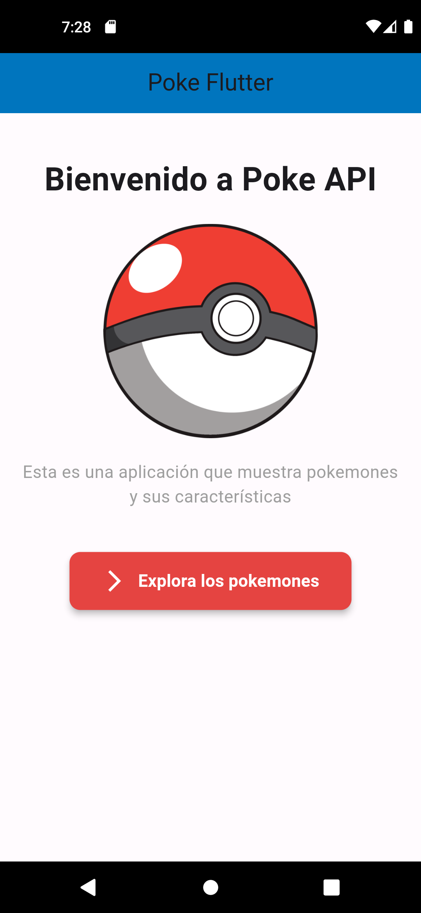
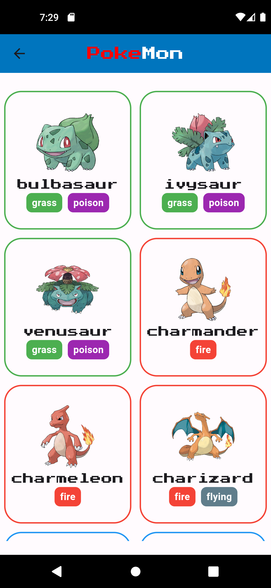

# Poke Flutter

[English](./README.md) | [Español](./README.es.md) | [Français](./README.fr.md) | [日本語](./README.jp.md)

## Description

Poke Flutter is a mobile application developed with Flutter that provides information about Pokémon. The application uses the [PokéAPI](https://pokeapi.co/) to fetch detailed data about different Pokémon, allowing users to explore and learn more about their favorite characters.

## Key Features

- **Pokémon List**: Displays a complete list of Pokémon with images and basic data.

### In Progress 

- ~**Pokémon Search**: Allows users to search for detailed information about any Pokémon.~
  
- ~**Detailed Information**: Provides details such as statistics, abilities, and more for each Pokémon.~

## Installation Requirements

- Flutter SDK: Make sure you have the Flutter SDK installed.
- Run `flutter pub get` to install the necessary dependencies.

## Usage Instructions

1. Clone or download the repository.
2. Open the project in your preferred Flutter-compatible code editor.
3. Connect a mobile device or start an emulator.
4. Run `flutter run` to compile and launch the application on the device/emulator.

## Screenshots

| **Home** | **Pokémon List** |
|:-----------------------:|:-----------------------:|
|  |  |

## Contributions

- Fork the repository.
- Create a new branch for your changes.
- Make necessary changes and commits.
- Submit a pull request with your proposed changes.

## License

This project is under the [MIT license](LICENSE). You can find more information by checking the [LICENSE](LICENSE) file in the project.